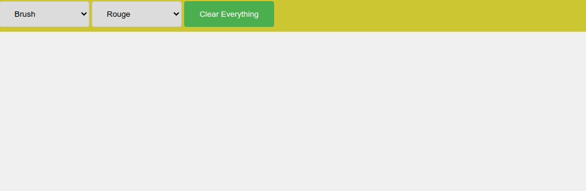

<div align="center">
  

# School of Electronic Engineering and Computer  Science

## ECS521U - INTERACTIVE MEDIA DESIGN AND PRODUCTION</br>Lab 5
</div>

### About this Lab
This lab focuses on adding interactive animation to HTML5 canvas using [Konva.js](https://konvajs.org/), a HTML5 2d canvas library.

## A. How does it works?
1. Every thing starts from `Konva.Stage` that contains several user’s layers (`Konva.Layer`) [https://konvajs.org/docs/overview.html](https://konvajs.org/docs/overview.html).
2. Each layer can contain shapes, groups of shapes, or groups of other groups.
3. The stage, layers, groups, and shapes are virtual nodes, similar to DOM nodes in an HTML page. E.g.:
   ```
                Stage
                   |
            +------+------+
            |             |
          Layer         Layer
            |             |
      +-----+-----+     Shape
      |           |
    Group       Group
      |           |
      +       +---+---+
      |       |       |
   Shape   Group    Shape
              |
              +
              |
            Shape
   ```

## B. Setup
1. Open `html/A.html` in browser (chrome/firefox/ie).
2. Open `js/A.js` in text editor.
3. Read and understand how a stage and a layer are created.

## C. Adding Mouse event to the whole stage
1. Add a mouseout event to the stage.
   ```js
   stage.on('mouseout', function() {
       writeMessage('Mouseout canvas');
   });
   ```
2. Add a mousemove event to the stage and display the mouse position.
   ```js
   stage.on('mousemove', function() {
       var mousePos = stage.getPointerPosition();
       var x = mousePos.x - 190;
       var y = mousePos.y - 40;
       writeMessage('x: ' + x + ', y: ' + y);
   });
   ```

## D. Associate events with different shapes on a canvas
This exercise was taken from [HTML5 Canvas Shape Events](https://konvajs.org/docs/events/Binding_Events.html).
1. Open `html/B.html` in browser (chrome/firefox/ie).
2. Open `js/B.js` in text editor.

### Draw a triangle as follows:
1. Add following triangle drawing function.
   ```js
   var triangle = new Konva.RegularPolygon({
       x: 80,
	   y: 120,
	   sides: 3,
	   radius: 80,
	   fill: '#00D2FF',
	   stroke: 'black',
	   strokeWidth: 4
   });
   ```

2. Add a mouseout event to the triangle.
   ```js
   triangle.on('mouseout', function() {
       writeMessage('Mouseout triangle');
   });
   ```

3. Add a mousemove event to the triangle and display the mouse position.
   ```js
   triangle.on('mousemove', function() {
       var mousePos = stage.getPointerPosition();
       var x = mousePos.x - 190;
       var y = mousePos.y - 40;
       writeMessage('x: ' + x + ', y: ' + y);
   });
   ```

4. Add the triangle to the layer.
   ```js
   layer.add(triangle);
   ```

### Draw circle as follows;
1. Add following circle drawing function.
   ```js
   var circle = new Konva.Circle({
       x: 230,
       y: 100,
       radius: 60,
       fill: 'red',
       stroke: 'black',
       strokeWidth: 4,
   });
   ```

2. Add following events to the circle.
   ```js
   circle.on('mouseover', function () {
       writeMessage('Mouseover circle');
   });
   circle.on('mouseout', function () {
       writeMessage('Mouseout circle');
   });
   circle.on('mousedown', function () {
       writeMessage('Mousedown circle');
   });
   circle.on('mouseup', function () {
       writeMessage('Mouseup circle');
   });
   ```

3. Add the circle to the layer.
   ```js
   layer.add(circle);
   ```

## E. Drag and Drop an Image
This exercise was taken from [HTML5 Canvas Drag and Drop an Image](https://konvajs.org/docs/drag_and_drop/Drag_an_Image.html).
1. Open `html/C.html` in browser (chrome/firefox/ie).
2. Open `js/C.js` in text editor.
3. Add the `Konva.Image` in the centre of the stage and make it draggable.
   ```js
   var pokemonImg = new Konva.Image({
       image: imageObj,
       x: stage.width() / 2 - 250 / 2,
       y: stage.height() / 2 - 247 / 2,
       width: 250,
       height: 247,
       draggable: true
   });
   ```
4. Change the cursor style.
   ```js
   pokemonImg.on('mouseover', function() {
       document.body.style.cursor = 'pointer';
   });

   pokemonImg.on('mouseout', function() {
       document.body.style.cursor = 'default';
   });
   ```
5. Add the KonvaImage to the layer.
   ```js
   layer.add(pokemonImg);
   ```
6. Add the layer to the stage.
   ```js
   stage.add(layer);
   ```
6. Load the image as follows;
   ```js
   var imageObj = new Image();

   imageObj.onload = function() {
	   drawImage(this);
   };

   imageObj.src = '../imgs/Bulbasour.png';
   ```

## F. Free Drawing
This exercise was taken from [Free Drawing Konva Demo](https://konvajs.org/docs/sandbox/Free_Drawing.html).
1. Open `html/todo.html` in browser (chrome/firefix/ie).
2. Open `html/todo.html` and `js/todo.js` in text editor.
3. Read the code and understand it.

## G. To Do Questions
Answer each question in the sections indicated by comments. If you need to modify other parts of the code, you can do it but remember to leave a comment saying which TODO question is related to the modification. E.g. `\\ this line is part of TODO 1` or `\\ part of TODO 1`



1. Add options to change and use at least 3 different brush colour.
2. Add an option to clear the whole canvas at once. **All shapes must be cleared from memory**.

## Submission Instructions:
### Deadline: 04/11/22 17:00
The Submission Link is available under ASSESMENT INFORMATION/RESOURCES Section of Module Page.
### General Instruction:
- Assignments must be submitted in a .zip package or alike ( .7z .bdoc .cdoc .ddoc .gtar .tgz .gz .gzip .hqx .rar .sit .tar .zip). Code submitted in other formats will not be accepted. Corrupt or otherwise unreadable files will not be accepted.
- Make sure to compress/zip the whole folder `ECS521-Interactive-Media-Design-and-Production-Labs-Work-2022-Lab-5` so all your work is included in the submission.
- Rename the compressed/zipped folder using your full name e.g.: `Giussepi Lopez.zip`

### Submission Checklist
- [x] Has your file been saved in a zip package?
- [x] Have you clicked [Submit] after uploading?
- [x] Have you checked that the file you uploaded is the correct version?
- [x] The first time you submit, you will be required to accept the Turnitin End User Licence Agreement.
- [x] After uploading, it is your responsibility to check that your file is in the correct format and that it is readable.

Late submissions will receive late penalties in line with the late penalty policy, see EECS handbook and QMUL assessment handbook.

### Specific Instructions:
1. To get half of the marks, your code should be fully functional with at least Question No. 1 solved completely.

## Good Luck!
